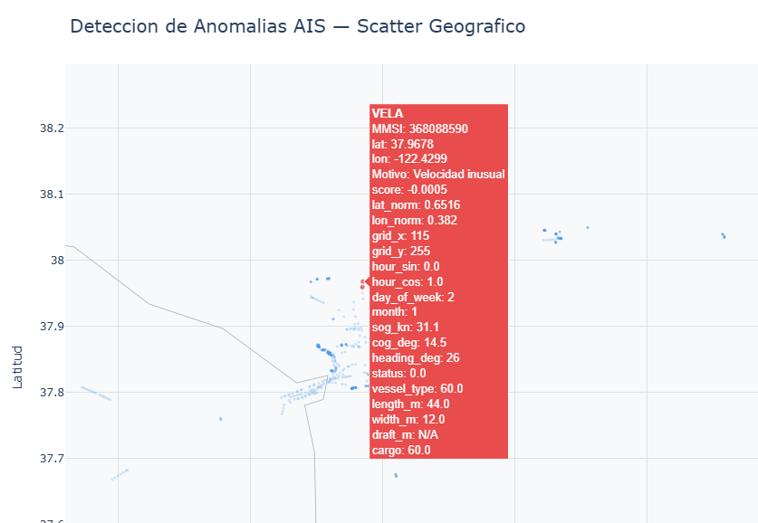

# AIS Anomaly Detection (H3)

Proyecto Python para deteccion de anomalias AIS con `IsolationForest`,
contexto geografico H3 + tipo de barco + franja horaria y graficos interactivos.

## Scripts principales (estado actual)

- `load_ais_data.py`: carga y preproceso AIS (fechas, limpieza, H3).
- `train_anomaly.py`: entrenamiento y exportacion de artefactos.
- `predict_realtime.py`: inferencia batch y por registro.
- `plot_anomalies.py`: grafico HTML de anomalias.

## Requisitos

- Python `>=3.11` (recomendado `3.14.x`).
- Dependencias en `requirements.txt`.

## Instalacion rapida (PowerShell)

```powershell
python -m venv .venv
.\.venv\Scripts\Activate.ps1
python -m pip install --upgrade pip
pip install -r requirements.txt
```

Si ya usas el entorno del repo, puedes ejecutar con `Scripts\python.exe`.

## Datos de entrada

- Entrenamiento completo: Coloca los datos de entrenamiento en `data/ais-data.csv`. El formato del CSV debe ser el mismo que el de data/ais-data-sample.csv, con las mismas columnas y tipos de datos.
- Pruebas rapidas (inferencia/graficos): `data/ais-data-sample.csv` u otro fichero de formato similar con los datos que quieras probar.

Los datos para entrenamiento y ejemplo se han bajado de https://coast.noaa.gov/htdata/CMSP/AISDataHandler/2025/index.html

## Flujo recomendado

### 1) Entrenar modelo

```powershell
python train_anomaly.py
```

Ejemplo con configuracion explicita del contexto temporal:

```powershell
python train_anomaly.py data/ais-data.csv --context-hour-mode bucket --hour-bucket-size 6 --min-obs-context 100
```

Artefactos generados en `models/`:

- `isolation_forest_model.joblib`
- `scaler.joblib`
- `imputer.joblib`
- `h3_stats.joblib`
- `h3_parent_stats.joblib`
- `h3_config.json`
- `metadata.json`

Ademas se genera `data/anomalies_summary.csv`.

### 2) Inferencia

Batch por CLI:

```powershell
python predict_realtime.py
python predict_realtime.py data/ais-data-sample.csv
```

Como modulo:

```python
from predict_realtime import AISAnomalyDetector
from load_ais_data import preprocess

detector = AISAnomalyDetector()
df = preprocess("data/ais-data-sample.csv")
out = detector.predict(df)
print(out[["is_anomaly", "anomaly_score", "anomaly_reason"]].head())
```

### 3) Graficos

Genera un mapa html interactivo con las anomalias detectadas.

Para el mapa del mundo usa los ficheros:

- `shp/world.shp`
- `shp/world.shx`
- `shp/world.dbf`


Ruta rapida (recomendada para pruebas):

```powershell
python plot_anomalies.py data/ais-data-sample.csv --suffix demo_sample
```

Ruta por defecto (si no pasas `csv_path`, usa `data/ais-data.csv`), que al ser todos los datos de entrenamiento será más lento.

```powershell
python plot_anomalies.py --suffix h3_full
```

Salida principal:

- `plots/anomalies_scatter_<suffix>.html`

Ejemplo de salida de `plot_anomalies.py`:



## Modelo actual

El modelo usa `IsolationForest` con:

- `n_estimators=100`
- `max_samples=1024`
- `contamination=0.01`
- `random_state=42`

Features actuales (29):

- Temporales: `hour_sin`, `hour_cos`, `day_of_week`, `month`
- Dinamicas: `sog`, `cog`, `heading`, `status`
- Estaticas: `vessel_type`, `length`, `width`, `draft`
- Contexto local `H3 + vessel_type + franja horaria` con fallback jerarquico:
  - `hex_log_density`, `is_sparse_hex`, `is_new_hex`
  - `sog_delta_hex_med`, `sog_z_hex`
  - `cog_delta_sin_hex`, `cog_delta_cos_hex`
  - `heading_delta_sin_hex`, `heading_delta_cos_hex`
  - `length_delta_hex_med`, `length_z_hex`
  - `width_delta_hex_med`, `width_z_hex`
  - `draft_delta_hex_med`, `draft_z_hex`
  - `vtype_mode_share_hex`, `is_unusual_vtype_hex`

Nota: `cargo` ya no se usa como feature del modelo.

## Salidas de inferencia

Columnas anadidas por inferencia:

- `is_anomaly` (`-1` anomalo, `1` normal)
- `anomaly_score` (mas negativo = mas anomalo)
- `anomaly_reason` (via SHAP, con fallback)

## Consejos practicos

- Para entrenar, usa `data/ais-data.csv`.
- Para pruebas de inferencia y graficos, usa `data/ais-data-sample.csv`.
- Si cambias el esquema de features, reentrena antes de inferir.

## Seccion tecnica: parametros de configuracion del entrenamiento

Estos son los parametros principales que controlan el entrenamiento actual en `train_anomaly.py`.

### Isolation Forest

- `CONTAMINATION = 0.01`: porcentaje objetivo de anomalias.
- `N_ESTIMATORS = 100`: numero de arboles.
- `MAX_SAMPLES = 1024`: muestras por arbol.
- `RANDOM_STATE = 42`: semilla para reproducibilidad.

### Preprocesado y transformacion

- `HEADING_NO_DISP = 511`: valor AIS para heading no disponible.
- Imputacion: `SimpleImputer(strategy="median")`.
- Escalado: `StandardScaler()`.

### Contexto geografico H3 y temporal

Definidos en `load_ais_data.py` y usados durante entrenamiento/inferencia:

- `H3_RESOLUTION = 7`.
- `H3_PARENT_RESOLUTION = 5`.
- `H3_MIN_OBS = 500`: umbral para usar contexto H3 puro.
- `H3_CONTEXT_MIN_OBS = 100`: umbral para usar contexto compuesto `H3 + vessel_type + franja`.
- `CONTEXT_HOUR_MODE = "bucket"`: por defecto usa franjas horarias.
- `HOUR_BUCKET_SIZE = 6`: 4 franjas de 6 horas por defecto.
- `H3_VTYPE_MIN_SHARE = 0.55`: share minimo para activar rareza de tipo.

### Features efectivas del modelo

`FEATURE_COLS` se construye con:

- Temporales: `hour_sin`, `hour_cos`, `day_of_week`, `month`.
- Dinamicas: `sog`, `cog`, `heading`, `status`.
- Estaticas: `vessel_type`, `length`, `width`, `draft`.
- Contexto local: `hex_log_density`, `is_sparse_hex`, `is_new_hex`,
  `sog_delta_hex_med`, `sog_z_hex`,
  `cog_delta_sin_hex`, `cog_delta_cos_hex`,
  `heading_delta_sin_hex`, `heading_delta_cos_hex`,
  `length_delta_hex_med`, `length_z_hex`,
  `width_delta_hex_med`, `width_z_hex`,
  `draft_delta_hex_med`, `draft_z_hex`,
  `vtype_mode_share_hex`, `is_unusual_vtype_hex`.

### Artefactos que reflejan esta configuracion

- `models/metadata.json`: features finales e hiperparametros.
- `models/h3_config.json`: configuracion H3, contexto temporal y estadisticas globales.

### Fallback del contexto local

Para velocidad, rumbo, orientacion y tamano, el contexto se resuelve en este orden:

1. `(h3_res7, vessel_type, time_band)`
2. `(h3_res7, vessel_type)`
3. `(h3_res7, time_band)`
4. `h3_res7`
5. `(h3_res5, vessel_type, time_band)`
6. `(h3_res5, vessel_type)`
7. `(h3_res5, time_band)`
8. `h3_res5`
9. global

Para rareza de tipo de barco, el fallback es:

1. `(h3_res7, time_band)`
2. `h3_res7`
3. `(h3_res5, time_band)`
4. `h3_res5`
5. global

### Parametros nuevos de `train_anomaly.py`

Puedes jugar con estos parametros desde PowerShell:

```powershell
python train_anomaly.py --context-hour-mode bucket --hour-bucket-size 6 --min-obs-context 100 --min-obs-hex 500 --vtype-min-share 0.55
```

- `--context-hour-mode {bucket,exact}`: usa franjas o la hora exacta `0..23`.
- `--hour-bucket-size N`: tamano de la franja horaria cuando el modo es `bucket`.
- `--min-obs-context N`: minimo de observaciones para aceptar el contexto fino.
- `--min-obs-hex N`: minimo de observaciones para aceptar el contexto H3 puro.
- `--vtype-min-share X`: share minimo para marcar `is_unusual_vtype_hex`.
- `--models-dir DIR`: carpeta de salida de artefactos.
- `--anomalies-csv PATH`: ruta del resumen CSV de anomalias.

## Autoria

Lo ha hecho Copilot con "experta" supervision de Chuidiang.

